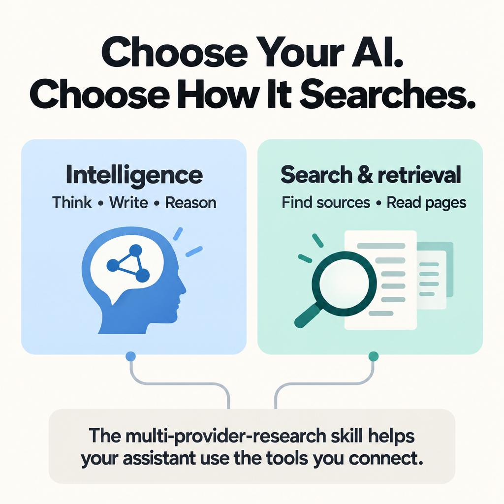

# Choose Your AI. Choose How It Searches.

A practical guide to choosing your AI assistant and its search tools separately—with the multi-provider-research skill to help them work together.

You may already use ChatGPT or Claude to think through a problem, write something, or find information. When an assistant searches for you, it is easy to think of the model and the search tool as one thing.

But **the intelligence that works with information and the tools that find that information are separate parts of the setup**. In an application that supports external tools, you can choose them separately: use the models and workspace you like, then connect search and retrieval services that suit your needs.

That gives you more freedom to choose where your assistant gets its evidence. It can also open up useful combinations at different price points.

I built the **multi-provider-research** skill to help an assistant work with those connected tools. You can start with one provider; you do not need a collection of subscriptions.

**[Explore the skill](https://github.com/goolamabbas/multi-provider-research)** · **[See how to get started](#start-with-one-skill-and-one-provider)** · **[Read the full guide](docs/README.md)**



## The pieces, in plain language

You do not need to know these terms beforehand:

| Term | What it means here |
| --- | --- |
| **Model** | The AI that interprets your request and generates a response. It can work with information supplied by external tools. |
| **Harness** | The application or workspace around the model. It manages your conversation and the tools the model can use. Think of it as the place where you work with AI. |
| **Provider** | In this guide, an external service that offers search or retrieval tools, such as Octen, TinyFish, Exa, or Perplexity. |
| **Connector or plugin** | A way for your application to access an external service. The name and setup process vary by application. You may also encounter **MCP**, a standard for connecting AI applications to tools. |
| **Skill** | A reusable package of instructions that an assistant can follow for a particular kind of task. The multi-provider-research skill gives guidance on using research tools. |

**Search** finds potentially useful sources. **Retrieval** brings back their contents so the assistant can use the evidence in its answer.

In this guide, your **intelligence stack** means your application and models. Your **search and retrieval stack** means the tools you connect to find and read sources. The skill helps the assistant decide how to use those tools.

## Why choose them separately?

You might like your assistant's writing and reasoning but want another way to find technical documentation, explore a topic from several angles, or read a webpage. A connected provider gives it another route to the information it needs, within the same workspace.

For example, when comparing two products, a search provider can find their official documentation, a retrieval tool can bring back the relevant pages, and your chosen assistant can use that evidence to explain the tradeoffs. Some providers also offer their own generated analysis; the skill helps distinguish that from retrieving sources for your assistant to interpret.

You can keep a setup that works for you and add a capability when you need it. You can also try a different research provider without choosing a new model solely for its bundled search. Better results still depend on the task, the sources, and how the assistant uses them.

This is useful for more than recent news. Research also means finding older documents, checking an original source, and distinguishing what the evidence supports from what remains uncertain.

## What the skill adds

Connecting tools gives your assistant access to them. The **multi-provider-research** skill supplies instructions for deciding how to use them in a research task.

I built it to help an assistant:

- Choose the smallest useful set of available providers. One can be enough.
- Give each provider a clear job when more than one is needed.
- Respect your instructions about which providers to use or exclude.
- Check source evidence and explain material gaps or failed retrievals.
- Distinguish retrieving sources from asking a provider to generate its own analysis.

The skill covers Octen, Exa, Perplexity, Parallel, Firecrawl, TinyFish, and authenticated X tools. You do not need all of them installed.

It is an instruction package, so its use depends on your application's support for skills and connected tools. It does not install providers, supply API keys, or include paid access to their services.

**[Get multi-provider-research on GitHub →](https://github.com/goolamabbas/multi-provider-research)**

## Start with one skill and one provider

### 1. Check your application, then install the skill

If you have only used ordinary chats so far, start by checking whether your application supports both external tools and installable skills. These are separate capabilities: being able to connect a provider does not automatically mean the application can load this skill. Availability and setup depend on the application and your account.

You can use a supported provider connection on its own. To follow the complete setup described here, choose an application that supports both the skill package and the provider connection.

Follow the [installation instructions in the skill repository](https://github.com/goolamabbas/multi-provider-research#install).

In brief: download the files from the skill repository (the project page on GitHub), then copy the complete `skills/multi-provider-research/` folder into the skills directory supported by your application. Keep its supporting folders intact and reload skills or start a fresh task as your application requires.

The correct location depends on your application. Use its current instructions rather than assuming that one directory works everywhere.

### 2. Connect your first provider

Start with a research task you actually want to complete. Then choose one provider that fits that task and has an integration supported by your application.

**Both Exa and TinyFish offer a way to get started without paying for retrieval immediately.** Exa provides a credit allowance; TinyFish offers free Search and Fetch within rate limits. Choose based on the work you want to do and the connection your application supports.

**Exa: explore search with a free credit allowance.** Its [Starter Free plan](https://exa.ai/pricing) currently includes **$20 in credits on sign-up and $10 in credits each month**, with no payment method required. The page lists access to all endpoints and MCP server access. Usage consumes credits at the applicable rates, so how far the allowance goes depends on the operations you choose. Follow the [official Exa setup guide](https://exa.ai/docs/get-started/exa-mcp) to connect it, then try a question within your free allowance.

**TinyFish: start here if avoiding extra retrieval costs is your priority.** Its Search and Fetch services are free within published limits: up to **30 Search requests per minute** and **150 fetched URLs per minute** on the wallet-based tier, even with a zero balance. The announcement says no credit card is required to start. This free offer covers Search and Fetch; do not assume it includes browser automation or every other TinyFish service. [Official free-tier terms and setup options](https://www.tinyfish.ai/blog/search-and-fetch-are-now-free-for-every-agent-everywhere).

Create an account, then use a supported integration to connect TinyFish to your application. Its setup page includes the hosted MCP route. For a first task, ask your assistant to search for sources and fetch the relevant pages using only TinyFish Search and Fetch.

**Octen: explore Broad Search when your question has several angles.** Broad Search takes one question, breaks it into related subqueries, and searches them concurrently. That makes it an option for comparisons and surveys—for example, researching a tool's features, limitations, integrations, and pricing together. Octen also offers focused Search and page extraction. Follow the [official Octen setup guide](https://docs.octen.ai/integrations/octen-mcp-server), which includes hosted MCP instructions for several applications. Check current usage charges before enabling it.

For example, after connecting Octen:

```text
Use the multi-provider-research skill and Octen Broad Search.

Compare [tool A] and [tool B] for [my use case] in [my country]. Cover features, usage limits, integrations, and pricing.
Prioritize official sources, link to the evidence, and distinguish
published prices from any estimated local-currency costs.
```

**Perplexity is another option to explore.** See its [official setup guide](https://docs.perplexity.ai/docs/getting-started/integrations/mcp-server) if its available capabilities suit your work. There is no need to connect all four providers before starting.

MCP is one way to connect an application to external tools. Your application may offer a plugin, connector, or another supported route instead. Complete setup and authentication, then test the connection from your application. Installing the research-routing skill is a separate step.

The [full guide](docs/README.md) covers more providers and includes copyable prompts. Add another provider when a task gives you a reason—for example, website extraction with Firecrawl or a different discovery approach with Exa or Parallel.

### 3. Try a real question

Replace the brackets below with your own details:

```text
Use the multi-provider-research skill.

Compare [tool A] and [tool B] for [my use case].
Use [my connected provider] to find current official documentation
and retrieve the relevant sources.

Have this assistant write the comparison from the retrieved evidence.
Include source links, explain the tradeoffs that matter for my use case,
and identify anything you could not verify.

If the provider is unavailable, tell me before substituting another one.
```

Look for a useful answer with supporting sources, a clear account of which tools contributed, and an honest explanation of missing evidence. If that setup meets your needs, you can keep it simple. Add another provider when you have a specific reason.

## This freedom of choice can also help with cost

Choosing these parts separately also lets you explore combinations that fit your budget. This can be especially useful in India, Pakistan, and other emerging markets, or anywhere you want to get more from what you already spend. A coding-oriented application can serve as a workspace for research and everyday assistance when it supports the necessary skills and tools.

**For readers in India, Cursor Start is a useful example.** Cursor [announced the plan on 28 July 2026](https://x.com/cursor_ai/status/2081978255004053560). Its [launch blog](https://cursor.com/blog/cursor-start-india) lists **₹649/month, including tax**, billed in INR with UPI or card, along with more agent requests than the free plan and support for plugins, MCP servers, hooks, and skills. Those connections are what make it relevant here: you can explore pairing Cursor's included model access with a separate research provider.

This is an India-specific offer, not a price to assume is available in Pakistan or other markets. Model names and allowances can change; confirm current eligibility, included usage, and pricing in your Cursor account before subscribing. The price above comes from the launch blog; the public pricing page retrieved for this guide did not display the regional Start offer.

**For a broader lower-cost option, Command Code lists its [Go plan at US$1/month](https://commandcode.ai/docs/plans/go) and its [GOAT plan at US$10/month](https://commandcode.ai/docs/plans/goat).** These are starting subscription prices with their own usage allowances, not promises of unlimited model use. Its [payment documentation](https://commandcode.ai/docs/resources/payment-methods) also describes UPI for INR-billed plans and Alipay for USD-billed plans. Check the payment options available to you at checkout.

Two combinations to explore are **Command Code Go + the multi-provider-research skill + Exa within its free credit allowance**, or **the same application and skill + TinyFish Search and Fetch within its free limits**. Both pair a low-cost model plan with a way to start retrieving sources without additional provider charges. These are suggested combinations, not end-to-end setups tested for this guide. Confirm that the application exposes the connected tools to your chosen model.

If you already pay for a compatible application, start by exploring its supported connections. Account for three things separately: your application or model plan, any research-provider charges, and local taxes or currency conversion. Free retrieval still uses your assistant's model allowance when it reads sources and writes an answer.

*Sources checked on 19 September 2026. Cursor Start details are attributed to its launch announcement; other listed prices and provider terms reflect the official pages retrieved on that date. Check the linked pages and checkout for changes before signing up.*

## Go deeper

- **[Multi-provider-research on GitHub](https://github.com/goolamabbas/multi-provider-research):** the skill package, installation instructions, and routing rules.
- **[Choosing External Research Tools for AI Agents](docs/README.md):** the detailed guide and copyable prompts, including examples that combine providers.
- **[My newsletter introduction](https://paragraph.com/@yusufg-ai-web3-curated-topics/a-practical-guide-to-choosing-external-research-tools-for-ai-agents):** more context on the approach.
- **[Artificial Analysis Search Index](https://artificialanalysis.ai/agents/search-api):** a benchmark resource to explore alongside your own task-based testing.

**Start with [the skill](https://github.com/goolamabbas/multi-provider-research#install), connect one provider, and try a question you care about.**
