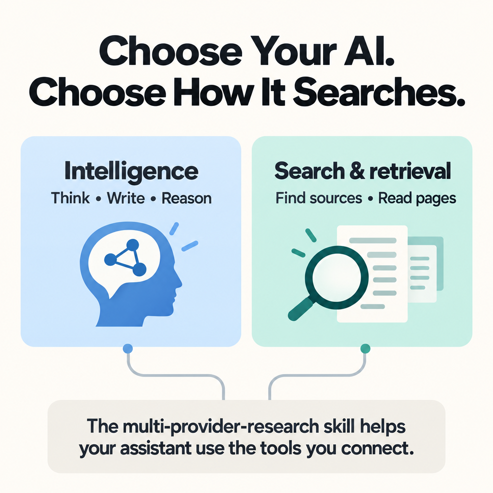

# Choose Your AI. Choose How It Searches.

A practical guide to choosing your AI assistant and its search tools separately—with the multi-provider-research skill to help them work together.

You may already use ChatGPT or Claude to think through a problem, write something, or find information. When an assistant searches for you, it is easy to think of the model and the search tool as one thing.

But **the intelligence that works with information and the tools that find that information are separate parts of the setup**. In an application that supports external tools, you can choose them separately: use the models and workspace you like, then connect search and retrieval services that suit your needs.

That gives you more freedom to choose where your assistant gets its evidence. It can also open up useful combinations at different price points.

I built the **multi-provider-research** skill to help an assistant work with those connected tools. You can start with one provider; you do not need a collection of subscriptions.

**[Explore the skill](https://github.com/goolamabbas/multi-provider-research)** · **[See how to get started](#start-with-one-skill-and-one-provider)** · **[Read the full guide](docs/README.md)**



## The pieces, in plain language

You do not need to know these terms beforehand:

| Term | What it means here |
| --- | --- |
| **Model** | The AI that interprets your request and generates a response. It can work with information supplied by external tools. |
| **Application** | The workspace around the model, sometimes called a harness. It manages your conversation and the tools the model can use. Think of it as the place where you work with AI. |
| **Provider** | In this guide, an external service that supplies search, retrieval, structured data, or analysis, such as Octen, TinyFish, Exa, or Perplexity. |
| **Connector or plugin** | A way for your application to access an external service. The name and setup process vary by application. You may also encounter **MCP**, a standard for connecting AI applications to tools. |
| **Skill** | A reusable package of instructions that an assistant can follow for a particular kind of task. The multi-provider-research skill gives guidance on using research tools. |

**Search** finds potentially useful sources. **Retrieval** brings back their contents so the assistant can use the evidence in its answer. Some providers also perform research and analysis using their own models. Choosing an Agent service such as Exa Agent Ultra delegates some reasoning to that service; it does not inherit your selected model.

In this guide, your **intelligence stack** means your application and models. Your **search and retrieval stack** means the tools you connect to find and read sources. The skill helps the assistant decide how to use those tools.

## Why choose them separately?

You might like your assistant's writing and reasoning but want another way to find technical documentation, explore a topic from several angles, or read a webpage. A connected provider gives it another route to the information it needs, within the same workspace.

For example, when comparing two products, a search provider can find their official documentation, a retrieval tool can bring back the relevant pages, and your chosen assistant can use that evidence to explain the tradeoffs. Some providers also offer their own generated analysis; the skill helps distinguish that from retrieving sources for your assistant to interpret.

You can keep a setup that works for you and add a capability when you need it. You can also try a different research provider without choosing a new model solely for its bundled search. Better results still depend on the task, the sources, and how the assistant uses them.

This is useful for more than recent news. Research also means finding older documents, checking an original source, and distinguishing what the evidence supports from what remains uncertain.

## What the skill adds

Connecting tools gives your assistant access to them. The **multi-provider-research** skill supplies instructions for deciding how to use them in a research task.

I built it to help an assistant:

- Choose the smallest useful set of available providers. One can be enough.
- Give each provider a clear job when more than one is needed.
- Respect your instructions about which providers to use or exclude.
- Check source evidence and explain material gaps or failed retrievals.
- Distinguish retrieving sources from asking a provider to generate its own analysis.

The skill covers Octen, Exa, Perplexity, Parallel, Firecrawl, TinyFish, and authenticated X tools. You do not need all of them installed.

It is an instruction package, so its use depends on your application's support for skills and connected tools. It does not install providers, supply API keys, or include paid access to their services.

**[Get multi-provider-research on GitHub →](https://github.com/goolamabbas/multi-provider-research)**

## Start with one skill and one provider

### 1. Check your application, then connect one provider

**Want a worked example?** [Follow the ChatGPT + TinyFish beginner walkthrough](https://goolamabbas.github.io/separate-intelligence-and-search/guide/tinyfish-beginner/) to connect one provider, add the skill, and inspect a real comparison of free video-meeting tools.

Choose an application that supports both connected tools and local skills. Connect one provider that fits your first question, then confirm it can return useful sources. The [ChatGPT + TinyFish walkthrough](https://goolamabbas.github.io/separate-intelligence-and-search/guide/tinyfish-beginner/) shows one complete path.

For other choices, use the [provider reference](https://goolamabbas.github.io/separate-intelligence-and-search/guide/choosing-providers/) and [connection guide](https://goolamabbas.github.io/separate-intelligence-and-search/guide/connecting-providers/). You do not need to connect every provider.

### 2. Add the routing skill

Add the complete `multi-provider-research` skill folder using the [installation instructions](https://github.com/goolamabbas/multi-provider-research#install). The [beginner walkthrough](https://goolamabbas.github.io/separate-intelligence-and-search/guide/tinyfish-beginner/#2-add-the-research-routing-skill) includes a copyable installation request and the verified macOS setup.

The skill supplies instructions; it does not install or pay for the provider.

### 3. Try a real question

Replace the brackets below with your own details:

```text
Use the multi-provider-research skill.

Use [my connected provider] to compare [tool A] and [tool B] for [my use case], using current official sources.
Keep all analysis and writing in this assistant. Explain the relevant tradeoffs and link to the evidence.
```

Look for a useful answer with supporting sources, a clear account of which tools contributed, and an honest explanation of missing evidence. If that setup meets your needs, you can keep it simple. Add another provider when you have a specific reason.

## This freedom of choice can also help with cost

Start with the application you already use and add a research service when it fills a useful gap.

[Explore free retrieval allowances and regional pricing examples](https://goolamabbas.github.io/separate-intelligence-and-search/guide/costs/). Each example retains its own source-check date.

## Go deeper

- **[Multi-provider-research on GitHub](https://github.com/goolamabbas/multi-provider-research):** the skill package, installation instructions, and routing rules.
- **[Choosing External Research Tools for AI Agents](docs/README.md):** the detailed guide and copyable prompts, including examples that combine providers.
- **[My newsletter introduction](https://paragraph.com/@yusufg-ai-web3-curated-topics/a-practical-guide-to-choosing-external-research-tools-for-ai-agents):** more context on the approach.
- **[Artificial Analysis Search Index](https://artificialanalysis.ai/agents/search-api):** a benchmark resource to explore alongside your own task-based testing.

**Start with [the skill](https://github.com/goolamabbas/multi-provider-research#install), connect one provider, and try a question you care about.**
