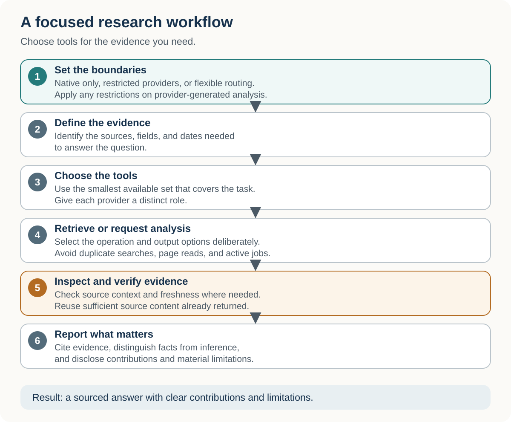
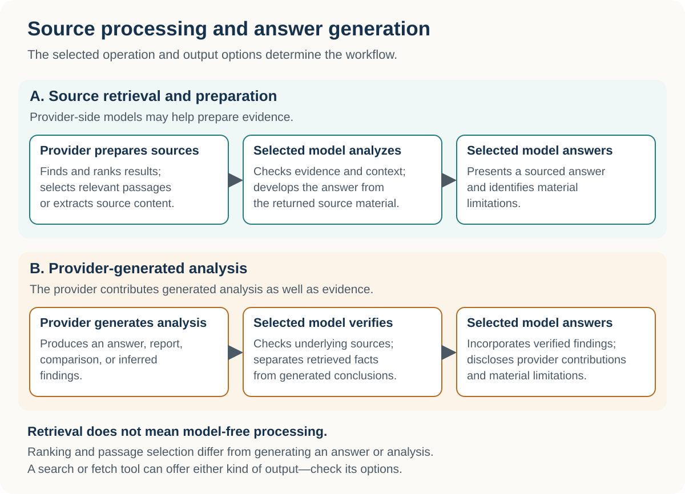

# Choosing External Research Tools for AI Agents

*A practical guide to web search, extraction, crawling, deep research, structured data, and browser automation.*

AI harnesses such as [ChatGPT](https://chatgpt.com/), [Codex](https://openai.com/codex/),  [Claude](https://claude.ai/) , [Claude Code](https://claude.com/product/claude-code),  [Manus](https://manus.im),  [Cursor](https://cursor.com/), [OpenCode](https://opencode.ai/), [Command Code](https://commandcode.ai/) and similar agent environments usually include web search or page-reading tools. Those built-in capabilities are often enough.

For more demanding work, external research providers can add broader discovery, semantic search, precise filters, site mapping and crawling, structured datasets, batch enrichment, cited synthesis, browser-rendered extraction, or interaction with dynamic pages.

This guide uses [Octen](https://octen.ai/), [Exa](https://exa.ai/), [Perplexity](https://docs.perplexity.ai/docs/getting-started/overview), [Parallel](https://parallel.ai/), [Firecrawl](https://www.firecrawl.dev/), and [TinyFish](https://www.tinyfish.ai/) as practical examples. They are illustrative, not exhaustive or ranked.

The central idea is simple: give each provider a distinct role, use only the providers the task needs, verify important claims against source content the agent has inspected, and report what worked.

**Last substantively reviewed:** September 2026. Provider tools, schemas, availability, and commercial terms can change.

[← Start with the introduction](../README.md)

## On this page

- [Choose your path](#choose-your-path)
- [Key terms](#key-terms)
- [Native search or external providers?](#native-search-or-external-providers)
- [Choose the operating mode before choosing tools](#choose-the-operating-mode-before-choosing-tools)
- [Choose by desired outcome](#choose-by-desired-outcome)
- [Three rules that prevent most problems](#three-rules-that-prevent-most-problems)
- [Source processing and answer generation](#source-processing-and-answer-generation)
- [Connect only the providers you need](#connect-only-the-providers-you-need)
- [Try it first: a compact prompt prefix](#try-it-first-a-compact-prompt-prefix)
- [Use the reusable routing skill](#use-the-reusable-routing-skill)
- [One practical example](#one-practical-example)
- [What a good research answer should report](#what-a-good-research-answer-should-report)
- [Continue reading](#continue-reading)
- [Final rule of thumb](#final-rule-of-thumb)

## Choose your path

New to external research tools? Start with **Native search or external providers?**, then try the short prompt below.

- [Compare providers and their modes](choosing-providers.md)
- [Connect and test a provider](connecting-providers.md)
- [Choose a ready-made research prompt](research-prompts.md)

Already have a provider connected? Go to **Try it first** or **Use the reusable routing skill** using the section links below.

## Key terms

| Term | Meaning here |
| --- | --- |
| **AI harness** | The application or agent environment that plans the task, calls tools, and presents the result |
| **Provider** | An external service supplying search, extraction, structured data, synthesis, or platform-native evidence |
| **MCP server or connector** | A supported way for the harness to call provider tools |
| **Skill** | Reusable instructions that tell the harness how to route work; a skill does not create provider access by itself |
| **Retrieval** | Finding or reading sources for the harness-selected model to analyze |
| **Provider-generated synthesis** | An answer, comparison, research report, or agent result produced by a model or workflow inside the provider |
| **Evidence lane** | A distinct source type or dataset assigned a clear role in the research |

## Native search or external providers?

Start with the search and page-reading tools already available in your AI application. They may be sufficient for a straightforward lookup or reading a known source.

Consider external providers when you need something specific: more precise discovery controls, specialized datasets, repeated research across a list, website mapping or crawling, browser-rendered pages, or provider-generated research.

Use the smallest set that covers the task. External services can add setup, cost, latency, and another service receiving the query. Capabilities vary by application and integration, so verify what is available rather than assuming an external tool is always better.

## Choose the operating mode before choosing tools

Choose the boundary that fits the task:

| Mode | What to permit |
| --- | --- |
| Native only | The current application’s built-in search and page-reading tools |
| Flexible external research | Relevant available providers, selected according to the evidence needed |
| Restricted providers | Only the providers and reading interfaces you explicitly permit |

**Required** means a provider must contribute to its assigned role. **May use** makes it optional. **Only** or **exactly** restricts the permitted set. State separately whether a native page reader may verify citations and what should happen if a required tool is unavailable.

The [prompt library](research-prompts.md) includes complete native-only and restricted-provider examples. Prompt instructions define the requested boundary; a profile with excluded tools disabled is needed when that boundary must be technically enforced.

## Choose by desired outcome

Start with the result you need, then choose among available tools that can supply it. These are examples, not exclusive matches or rankings.

| Need | Useful starting point |
| --- | --- |
| Find sources or read a page | Native tools may suffice; external options include Octen, Exa, Perplexity Search, Parallel Search, Firecrawl Search/Scrape and TinyFish |
| Obtain specialized or comparable fields | Relevant Exa Connect datasets; use ordinary document retrieval when a supplied source already answers the question |
| Apply the same research fields across a list | Parallel Task Group or a suitable Exa Agent workflow |
| Inventory or collect a website section | Firecrawl Map, selected Scrapes, or a bounded Crawl |
| Read a dynamic page | Browser-rendered extraction, such as TinyFish page extraction |
| Request provider-generated analysis | A suitable Perplexity synthesis mode, Parallel Task, or Exa Agent workflow |
| Retrieve authenticated X content | One authenticated X-native interface |

For tool-level distinctions, see [Choosing an external research provider](choosing-providers.md).



Choose the permitted tools, retrieve the evidence, and report what matters.

## Three rules that prevent most problems

### 1. Verify relevant access

A provider named in a prompt is not necessarily callable or authenticated. Inspect the relevant tools and confirm what actually returns useful evidence.

### 2. Avoid routine duplication

Give each provider a distinct job. Do not repeat successful searches or page reads merely to increase provider count.

### 3. Verify evidence and freshness

Inspect source content supporting important claims. Excerpts or full text returned by search can suffice when they contain the relevant facts and qualifications. Retrieve more context when the evidence is ambiguous, incomplete, conflicting, or potentially stale. Generated answers are synthesis and require supporting source evidence. For changing facts, check observation dates and available cache controls. Fetching a page today does not establish that its contents are current.

## Source processing and answer generation

Search and extraction tools may use provider-side models to rank results, select relevant passages, or compress the material returned to your agent. Some output modes also generate summaries. Retrieval therefore does not mean “no AI processing outside your selected model.”

The useful distinction is between **preparing source material** and **generating an answer or analysis**.

| Operation | What normally happens |
| --- | --- |
| **Source retrieval and preparation** | The provider finds, ranks, or selects source material. The model selected in your application develops the answer from that evidence. |
| **Provider-generated answers or analysis** | A provider-side model or workflow produces an answer, comparison, research report, or inferred findings. Your selected model may then verify and incorporate that output into its final response. |

For example, Firecrawl describes using a relevance model to select excerpts, while Exa’s Dynamic Highlights selects relevant text across retrieved documents. These are examples of model-assisted source preparation; they do not by themselves mean the provider writes the research answer. Availability depends on the integration and options used. [Firecrawl’s explanation](https://www.firecrawl.dev/blog/introducing-our-most-accurate-search-yet) · [Exa’s explanation](https://exa.ai/blog/dynamic-highlights)

Provider-generated analysis includes workflows such as Perplexity Ask, Reason, and Research; Exa Agent, including runs using Connect datasets; Parallel Deep Research and Task Group; and Firecrawl Agent. These workflows may combine retrieval, extraction, and inference, so distinguish returned source data from generated conclusions.

Check the **selected operation and output options**, not just the provider or tool name. A fetch or scrape tool may offer both source content and generated answers.

### Keeping analysis in your selected model

For ordinary lookups, retrieving source material and having your selected model develop the answer is a useful default. If you want that boundary to be explicit, add:

```
Use external tools to retrieve source content and relevant excerpts. Model-assisted ranking and passage selection are permitted.

Do not request provider-generated summaries, answers, research reports, or agent analysis, including through output options inside search, fetch, or scrape tools.

Have the model selected in this application perform the analysis and final answer generation.
```

This controls the requested output and workflow. It does not guarantee that external services perform no internal model processing.

### Verify the evidence in either workflow

Selected excerpts can omit useful context, and generated analysis can misinterpret its sources. Inspect the underlying content when a claim depends on qualifications, surrounding text, or conflicting evidence. If sufficient source content has already been returned, a duplicate fetch is unnecessary.

When provider-generated analysis contributes to the answer, identify the operation used and its model or preset when disclosed. Do not assume it uses the model selected in your application.



## Connect only the providers you need

Provider access and the routing skill do different jobs. Access may come through a supported provider skill, MCP server, plugin, connector, command-line client, or direct API. Choose the route that fits your application and supplies the capabilities you need. The routing skill guides when and how to use those capabilities; it does not require every provider to use the same integration method.

One working provider is enough to start. Connect it, run a small read-only check, and confirm useful results before adding more. See [Installing and testing external research providers](connecting-providers.md) for setup and optional project-instruction snippets.

## Try it first: a compact prompt prefix

Once a suitable external provider is connected, try:

```
Use the relevant external research tools available in this session. Check access first, choose the smallest useful set, and avoid duplicate searches or page reads. Support important claims with inspected source content, distinguish facts from inference, and report tools used and material limitations.

Research question: [YOUR QUESTION]
```

Add provider or synthesis restrictions when they matter. The prompt library contains more detailed patterns.

## Use the reusable routing skill

The `multi-provider-research` skill packages the detailed routing rules so your prompt can stay short. It works with any available subset of supported providers, including one.

1. Connect and test at least one provider.
2. Follow the [current installation instructions](https://github.com/goolamabbas/multi-provider-research#install). Keep the complete inner `skills/multi-provider-research/` folder and its supporting files intact. When updating, back up and replace the complete folder rather than overlay-merging; the archive wrapper is not the installable folder.
3. Start a fresh task so the application can discover it.
4. Try:

```
Use the multi-provider-research skill.

Research question: [YOUR QUESTION]
```

The natural-language invocation is portable; skill installation and discovery depend on the application. The skill does not install, authenticate, or pay for providers.

### GitHub repository for multi-provider-research skill

- [Public GitHub repository](https://github.com/goolamabbas/multi-provider-research)
- [Releases](https://github.com/goolamabbas/multi-provider-research/releases)

## One practical example

### Read and compare product documentation

```
Use the multi-provider-research skill.

Use regular Exa Search and Fetch as the only research tools and page readers. Do not use a native page reader. Use source-content modes, not generated summaries or answers; have the model selected in this application perform the analysis. If Exa is unavailable, report the gap without substituting another provider. Compare the documented export formats and data-portability options of [PRODUCT A] and [PRODUCT B]. Inspect official source content, distinguish documented support from inference, and report inaccessible or unclear evidence. Do not use Exa Agent or another provider.
```

For specialized datasets, provider-generated research, and complementary-provider workflows, use the [prompt library](research-prompts.md).

## What a good research answer should report

A useful answer identifies its sources, separates facts from inference, and briefly names the tools used, their contributions, and material limitations.

Expand the report when coverage, provenance, reproducibility, or an audit request requires it. Relevant details may include filters, observation dates, confirmed dataset contributions, pending jobs, and failed verification. A simple X lookup or two-provider task does not automatically need a full ledger.

## Continue reading

[Choosing an external research provider](choosing-providers.md)

[Connecting and testing providers](connecting-providers.md)

[Research prompt examples](research-prompts.md)

## Final rule of thumb

Choose tools for the evidence you need. Require a provider when its contribution matters, restrict the permitted set when that boundary matters, and otherwise let the agent choose the smallest useful set.
