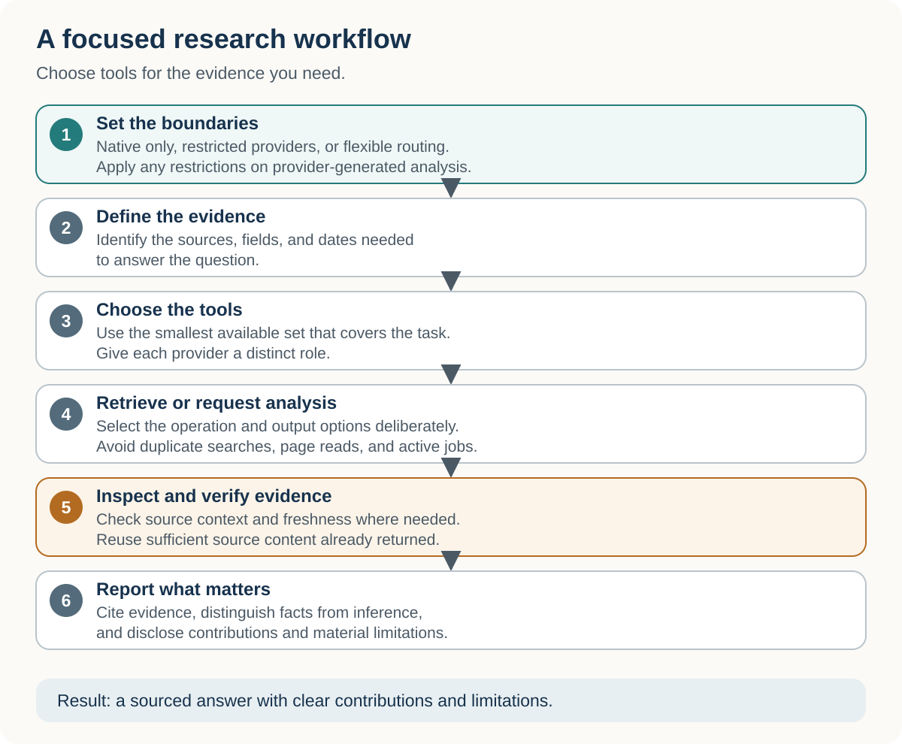
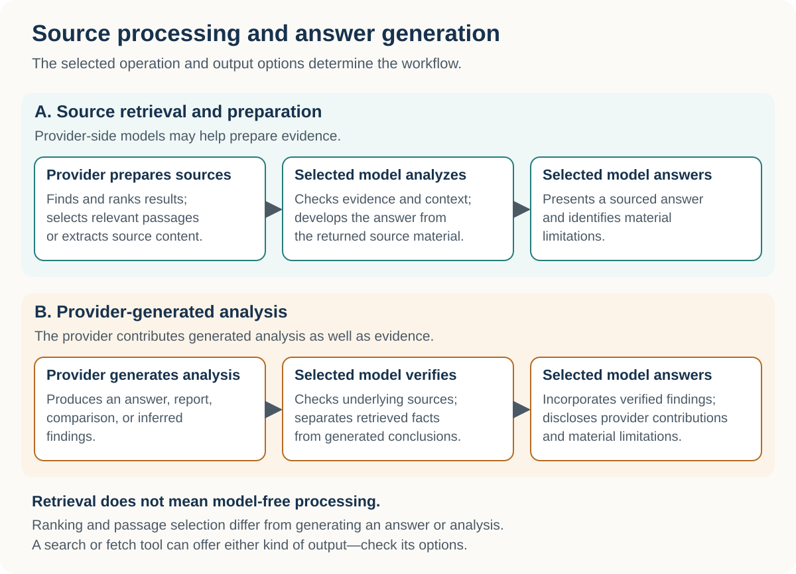

# Choosing External Research Tools for AI Agents

*A practical guide to choosing research tools, connecting them, and judging the evidence they return.*

**Use the smallest permitted toolset that can supply the evidence your question needs.** Start with your application's built-in search and page reader. Add an external provider when it fills a specific gap, confirm that it works, and judge the answer against the sources—not the number of tools used.

External providers can add precise discovery controls, specialized datasets, batch research, website crawling, browser-rendered extraction, or provider-generated analysis. The choice depends on your task and the capabilities your application actually exposes.

This guide takes you through three decisions: **what evidence to obtain, how to obtain it reliably, and whether it supports the answer.** The provider reference, connection instructions, and prompt cookbook supply the details when you need them.

**Last substantively reviewed:** September 2026. Provider tools, schemas, availability, and commercial terms can change.

[← Start with the introduction](../README.md)

## On this page

- [Choose your path](#choose-your-path)
- [Key terms](#key-terms)
- [Choose tools for the evidence you need](#choose-tools-for-the-evidence-you-need)
- [Make one provider work before adding more](#make-one-provider-work-before-adding-more)
- [Judge the answer by its evidence](#judge-the-answer-by-its-evidence)
- [Continue reading](#continue-reading)

## Choose your path

For a first setup, follow the guide in order:

1. **Choose:** decide what your question needs and which tools are permitted.
2. **Connect:** test one suitable provider, then use a prompt or add the routing skill.
3. **Evaluate:** check the supporting sources and any important gaps before relying on the answer.

Already connected? Try the [compact prompt](#try-it-first-a-compact-prompt-prefix) or [add the routing skill](#use-the-reusable-routing-skill).

Already know what you need? Use the [provider reference](choosing-providers.md), [connection instructions](connecting-providers.md), or [prompt cookbook](research-prompts.md) directly.

## Key terms

| Term | Meaning here |
| --- | --- |
| **Application (sometimes called a harness)** | The application or agent environment that plans the task, calls tools, and presents the result |
| **Provider** | An external service supplying search, extraction, structured data, synthesis, or platform-native evidence |
| **MCP server or connector** | A supported way for the application to call provider tools |
| **Skill** | Reusable instructions that tell the application how to route work; a skill does not create provider access by itself |
| **Retrieval** | Finding or reading sources for the model selected in your application to analyze |
| **Provider-generated synthesis** | An answer, comparison, research report, or agent result produced by a model or workflow inside the provider |
| **Evidence role** | A distinct source type or dataset assigned a clear role in the research |

## Choose tools for the evidence you need

A provider is useful when it fills an evidence gap within the boundaries you set. Decide what must be found, which services may receive the task, and whether they should retrieve sources or generate analysis.

### Native search or external providers?

Start with the search and page-reading tools already available in your AI application. They may be sufficient for a straightforward lookup or reading a known source.

Consider external providers when you need something specific: more precise discovery controls, specialized datasets, repeated research across a list, website mapping or crawling, browser-rendered pages, or provider-generated research.

Use the smallest set that covers the task. External services can add setup, cost, latency, and another service receiving the query. Capabilities vary by application and integration, so verify what is available rather than assuming an external tool is always better.

### Choose the operating mode before choosing tools

Choose the boundary that fits the task:

| Mode | What to permit |
| --- | --- |
| Native only | The current application’s built-in search and page-reading tools |
| Flexible external research | Relevant available providers, selected according to the evidence needed |
| Restricted providers | Only the providers and reading interfaces you explicitly permit |

**Required** means a provider must contribute to its assigned role. **May use** makes it optional. **Only** or **exactly** restricts the permitted set. State separately whether a native page reader may verify citations and what should happen if a required tool is unavailable.

The [prompt library](research-prompts.md) includes complete native-only and restricted-provider examples. Prompt instructions define the requested boundary; a profile with excluded tools disabled is needed when that boundary must be technically enforced.

### Choose by desired outcome

Use the [provider quick chooser](choosing-providers.md#quick-chooser) to match your question to a capability: finding sources, collecting a website, obtaining structured data, or requesting provider-generated analysis. The chooser is the maintained comparison table; these are possible starting points, not rankings.



Choose the permitted tools, retrieve the evidence, and report what matters.

### Source processing and answer generation

**Retrieval supplies source material; provider-generated analysis supplies conclusions.** Your selected model can write the answer from retrieved sources, or incorporate analysis produced by a provider when you permit it. Retrieval may still use internal models for ranking or extraction.

Read [retrieval and provider-side synthesis](choosing-providers.md#retrieval-and-provider-side-synthesis) for the full distinction and operation examples. Check output options as well as tool names: a fetch tool can also offer generated summaries.

#### Keeping analysis in your selected model

For ordinary lookups, retrieving source material and having your selected model develop the answer is a useful default. If you want that boundary to be explicit, add:

```
Use external tools to retrieve source content and relevant excerpts. Model-assisted ranking and passage selection are permitted.

Do not request provider-generated summaries, answers, research reports, or agent analysis, including through output options inside search, fetch, or scrape tools.

Have the model selected in this application perform the analysis and final answer generation.
```

This controls the requested output and workflow. It does not guarantee that external services perform no internal model processing.



## Make one provider work before adding more

A working connection comes before routing instructions. Confirm that one suitable provider returns useful evidence, then decide whether a short prompt is enough or a reusable skill will help.

### Connect only the providers you need

Provider access and the routing skill do different jobs. Access may come through a supported provider skill, MCP server, plugin, connector, command-line client, or direct API. Choose the route that fits your application and supplies the capabilities you need. The routing skill guides when and how to use those capabilities; it does not require every provider to use the same integration method.

One working provider is enough to start. Connect it, run a small read-only check, and confirm useful results before adding more. See [Installing and testing external research providers](connecting-providers.md) for setup and optional project-instruction snippets.

### Verify access and give each provider a distinct job

<a id="1-verify-relevant-access"></a>

A provider named in a prompt is not necessarily callable or authenticated. Inspect the relevant tools and confirm what actually returns useful evidence.

<a id="2-avoid-routine-duplication"></a>

Give each provider a distinct job. Do not repeat successful searches or page reads merely to increase provider count.

### Try it first: a compact prompt prefix

Once a suitable external provider is connected, try:

```
Use the relevant external research tools available in this session. Check access first, choose the smallest useful set, and avoid duplicate searches or page reads. Support important claims with inspected source content, distinguish facts from inference, and report tools used and material limitations.

Research question: [YOUR QUESTION]
```

Add provider or synthesis restrictions when they matter. The prompt library contains more detailed patterns.

### Use the reusable routing skill

For a complete first task, [try ChatGPT with TinyFish](https://goolamabbas.github.io/separate-intelligence-and-search/guide/tinyfish-beginner/). The walkthrough includes setup instructions, the actual comparison, and what was verified.

The `multi-provider-research` skill packages the detailed routing rules so your prompt can stay short. It works with any available subset of supported providers, including one.

1. Connect and test at least one provider.
2. Follow the [current installation and update instructions](https://github.com/goolamabbas/multi-provider-research#install) for the complete skill package.
3. Start a fresh task so the application can discover it.
4. Try:

```
Use the multi-provider-research skill.

Research question: [YOUR QUESTION]
```

The natural-language invocation is portable; skill installation and discovery depend on the application. The skill does not install, authenticate, or pay for providers.

For provider restrictions, native-tool permissions, or fallback choices, add only the relevant [control clauses](research-prompts.md#useful-control-clauses). The [everyday prompt and defaults](research-prompts.md#minimum-sufficient-provider-set) explain what the skill handles for you.

#### GitHub repository for multi-provider-research skill

- [Public GitHub repository](https://github.com/goolamabbas/multi-provider-research)
- [Releases](https://github.com/goolamabbas/multi-provider-research/releases)

### One practical example

#### Read and compare product documentation

```
Use the multi-provider-research skill.

Use regular Exa Search and Fetch as the only research tools and page readers. Do not use a native page reader. Use source-content modes, not generated summaries or answers; have the model selected in this application perform the analysis. If Exa is unavailable, report the gap without substituting another provider. Compare the documented export formats and data-portability options of [PRODUCT A] and [PRODUCT B]. Inspect official source content, distinguish documented support from inference, and report inaccessible or unclear evidence. Do not use Exa Agent or another provider.
```

For specialized datasets, provider-generated research, and complementary-provider workflows, use the [prompt library](research-prompts.md).

## Judge the answer by its evidence

Successful tool calls do not establish that an answer is correct. Check whether inspected sources support the important claims, whether their dates fit the question, and whether missing evidence could change the conclusion.

### Verify evidence and freshness

<a id="3-verify-evidence-and-freshness"></a>

Inspect source content supporting important claims. Excerpts or full text returned by search can suffice when they contain the relevant facts and qualifications. Retrieve more context when the evidence is ambiguous, incomplete, conflicting, or potentially stale. Generated answers are synthesis and require supporting source evidence. For changing facts, check observation dates and available cache controls. Fetching a page today does not establish that its contents are current.

### Verify the evidence in either workflow

Selected excerpts can omit useful context, and generated analysis can misinterpret its sources. Inspect the underlying content when a claim depends on qualifications, surrounding text, or conflicting evidence. If sufficient source content has already been returned, a duplicate fetch is unnecessary.

When provider-generated analysis contributes to the answer, identify the operation used and its model or preset when disclosed. Do not assume it uses the model selected in your application.

### What a good research answer should report

A useful answer identifies its sources, separates facts from inference, and briefly names the tools used, their contributions, and important limitations.

Expand the report when coverage, provenance, reproducibility, or an audit request requires it. Relevant details may include filters, observation dates, confirmed dataset contributions, pending jobs, and failed verification. A simple X lookup or two-provider task does not automatically need a full ledger.

### Worked example: inspect one delegated investigation

[Inside one Exa Ultra research run](https://goolamabbas.github.io/separate-intelligence-and-search/guide/exa-ultra-case-study/) separates the assistant-designed assignment, Exa-generated findings, and assistant interpretation. Read the short explanation or inspect the complete catalogue and original files. It is an unaudited case study, not a comparative benchmark.

### Three rules that prevent most problems

Before relying on the result, check: **did the relevant tools work, did each provider have a useful role, and do the sources support the answer?** More tools and longer reports are not substitutes for those checks.

## Continue reading

- **Choose a capability:** [Choosing an external research provider](choosing-providers.md).
- **Make it available:** [Connecting and testing providers](connecting-providers.md).
- **Apply it to a task:** [Research prompt examples](research-prompts.md).

### Final rule of thumb

Choose tools for the evidence you need. Require a provider when its contribution matters, restrict the permitted set when that boundary matters, and otherwise let the agent choose the smallest useful set.
